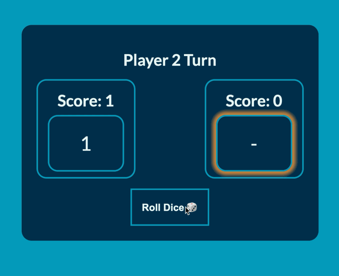

# Dice Game

This is a very basic 2 player dice game. 

Players take turns clicking the Roll Dice button, adding their rolls to their score. When a player hits 20 or above, they are delared winner and the roll button turns into a reset button that sets the game back to the start when clicked. 